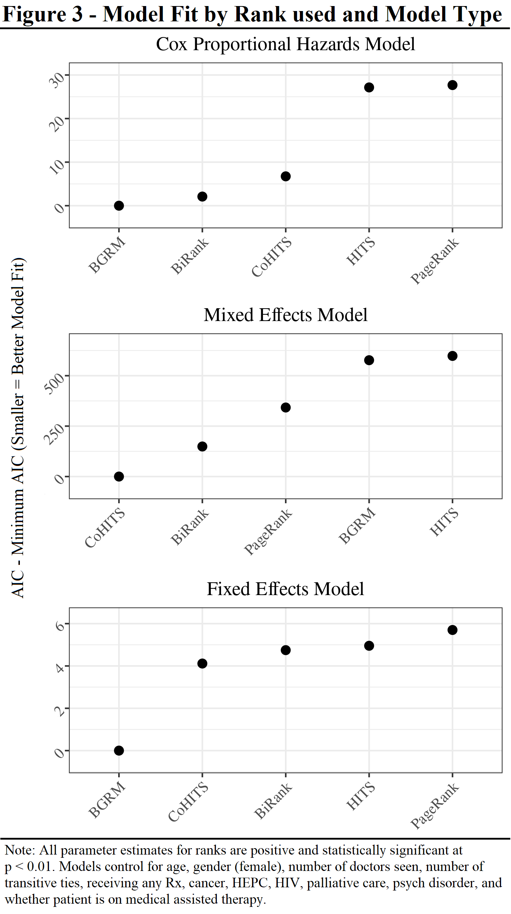

# Opioid-Insurance

  

# Overview
Using private insurance data, this repository tracks doctor-patient ties by opioid prescriptions, and estimates how a patient's position in the network may predict subsequent opioid abuse (n = ~150m patient-quarters). The repository assumes that that patients who are more central in doctor-patient networks are likely to have intentionally sought out generous opioid providers (i.e. such patients could be labeled doctor-shoppers) and are more likely to abuse opioids. The repository's purpose, however, is to determine how to best measure a patients' centrality in the doctor-patient network. The repository compares traditional measures of centrality (PageRank based on a one-mode projection of the network) with bipartite measures of centrality (HITS, CoHITS, BGRM, and BiRank) in the doctor-patient network.  There are strong theoretical reasons for why bipartite ranking algorithms would better capture node centrality and doctor-shopping behavior than unipartite ranking algorithms, but bipartite measures of centrality are almost never used in studies of real world social networks. Consistent with expectations, results indicate that bipartite measures of centrality in doctor-patient networks (especially BGRM and BiRank) are consistently more predictive of subsequent opioid abuse than are traditional measures of centrality (PageRank). These results suggest that bipartite measures of centrality are better indicators of doctor-shopping than are unipartite measures of centrality, and imply that bipartite measures could be useful indicators of centrality in other social networks contexts. 
